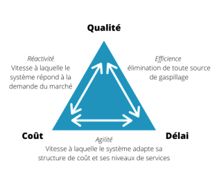
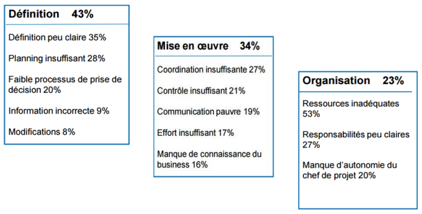
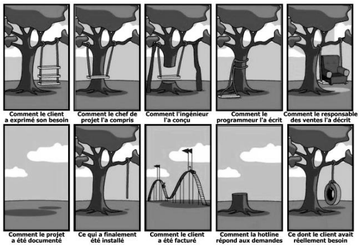
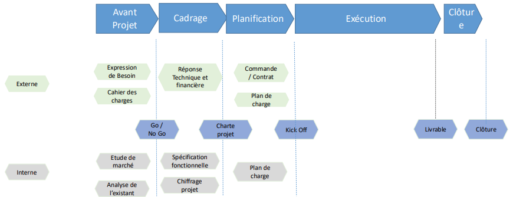
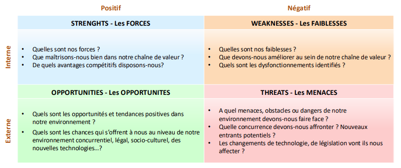
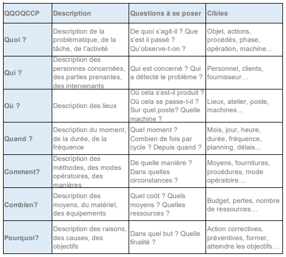

### [📝 [PDF] Support de Cours](A1N1_Ingenierie-et-Jalons.pdf)

### [📝 [PDF] Trame Charte Projet](charte-projet_exemple.pdf)

### [📝 [DOCX] Trame Charte Projet](charte-projet_exemple.docx)

### [📝 [XLSX] Trame Plan de Charge](plan-de-charge_exemple.xlsx)

### [📝 [XLSX] Trame RACI](raci_exemple.xlsx)

### [🧪 [h4down] Exercice QQQOPCC](exo.md)

### [🧪 [PDF] TP Charte Projet](charte-projet_tp.pdf)

### [🧪 [DOCX] TP Charte Projet](charte-projet_tp.docx)

---

### [↺ Retour](../README.MD)

---

### [↺ Racine](../../../README.MD)

---

# Formation "Ingénierie de Projet et ses Jalons Clés"

<i>11 décembre 2024</i>

---

#### [➤&nbsp;A. Définition d'un Projet](README.MD#a-definition-dun-projet)

#### [➤&nbsp;B. Les Etapes d'un Projet](README.MD#b-gestion-de-projet)

#### [➤&nbsp;C. D](README.MD#c-)

#### [➤&nbsp;D. F](README.MD#d-)

#### [➤&nbsp;E. G](README.MD#e-)

---

# A. DEFINITION D'UN PROJET

> ## Définition
>
> > <dl>
> >  <dt>Un projet est un processus <b>unique</b> qui consiste en:</dt>
> >
> > - <dd>Un ensemble d'activités coordonnées et maîtrisées,</dd>
> >
> > - <dd>Comportant des dates de début et de fin,</dd>
> >
> > - <dd>Entrepris dans le but d'atteindre un objectif conforme à des exigences spécifiques,</dd>
> >
> > - <dd>Incluant des contraintes de délais, de coûts et de ressources.</dd>
> >
> > </dl>
>
> ---
>
> ## Contraintes
>
> > 
>
> ---
>
> ## Causes d'échecs d'un projet
>
> > 

> >   
<em>SPOILER</em>

> >
> >  
> >
> > 
> >
> >  
> >
> > 
> >
> > 

>
> ---

# B. GESTION DE PROJET

> ## Définition
>
> > C’est un ensemble de moyens, d’activités et d’actions qui vont être mises en place au sein du projet afin de:
> >
> > > - organiser le bon déroulement
> > > - atteindre les objectifs fixés en termes de délais, cout et qualité
> > > - piloter et communiquer sur le projet
> >
> > Elle s’appuie sur des méthodes, techniques et outils adaptés à chaque étape du projet (de l’avant projet à sa clôture).
>
> ---
>
> ## Timeline du projet
>
> > | Avant-Projet            | Cadrage                                                                                             | Planification                                                             | Exécution et Surveillance                                                                                                                                  | Clotûre                                                                                                               |
> > | ----------------------- | --------------------------------------------------------------------------------------------------- | ------------------------------------------------------------------------- | ---------------------------------------------------------------------------------------------------------------------------------------------------------- | --------------------------------------------------------------------------------------------------------------------- |
> > | Décision de faisabilité | <li>Définition du projet</li><li>Définition des objectifs/besoins</li><li>Signature du contrat</li> | <li>Temps</li><li>Coûts</li><li>Risques</li><li>Découpage des tâches</li> | <li>Coordination des ressources</li><li>Réalisation du périmètre</li> <li>Vérification de la maîtrise des objectifs, mesure et actions correctives</li> | <li>Formalisation de la fin du projet avec le client</li><li>Réaffectation des ressources sur d’autres activités</li> |
> >
> > > 

> > >   
<em>SPOILER</em>

> > >
> > >  
> > >
> > > 
> > >
> > > 

>
> ---
>
> ## Avant-Projet
>
> > ### Définition
> >
> > > L'objectif de cette phase est de disposer d'informations pertinentes pour éclairer la décision de démarrer ou non le projet.
> > >
> > > Les informations d’ordre techniques recueillies permettent de savoir si :
> > >
> > > > - Les compétences et les moyens techniques de l'organisation sont mobilisables en interne ou en externe pour le projet.
> > > >
> > > > - Définir le bilan économique du projet en termes de retour sur investissement (ROI) et par rapport au marché.
> > >
> > > Il peut-être judicieux de baser la décision de lancement d’un projet suite à une analyse _‘terrain’_ comme:
> > >
> > > > - Etude de marché:
> > > >
> > > > > L’objectif est d’aider les décideurs à définir le type de projet à développer, le montage financier, et toutes les informations à analyser au préalable. Elle contient les opportunités à développer le projet en interne ou en externe et ce que cela va pouvoir apporter.
> > > >
> > > > - L’expression de besoin:
> > > >
> > > > > C’est un descriptif expliquant les raisons pour lesquelles le projet et l’installation sont nécessaires. Il décrit aussi le type et les caractéristiques de performances de l’installation et les améliorations que cela va apporter.
> >
> > ### A Retenir
> >
> > > La phase d’avant projet:
> > >
> > > > - Identifie un besoin
> > > > - Le confronte aux contraintes techniques et économiques et aux risques en interne et en externe
> > > > - Le soumet aux décideurs
> > > > - Valide le besoin ou non de lancer le projet
> > >
> > > Le chef de projet n’est pas encore nommé, il n’est nommé que si il y a un GO.
> > >
> > > Cette phase doit se baser sur des documents d’étude de marché et d’expression du besoin.
>
> ---
>
> ## Cadrage
>
> > ### La Charte du Projet
> >
> > > 

> > >  
<h4><b>Définition des objectifs</b></h4>

> > >  
> > >
> > > > <li>Défini les objectifs du projet et les critères de mesure de succès.</li>
> > >
> > > 

> > >  
> > >
> > > ---
> > >
> > > 

> > >  
<h4><b>Périmètre du projet</b></h4>

> > >  
> > >
> > > > <li>Description générale des inclusions et exclusions du projet.</li>
> > >
> > > > <li>Détaille également les caractéristiques du produit, service ou résultat à atteindre.</li>
> > >
> > > 

> > >  
> > >
> > > ---
> > >
> > > 

> > >  
<h4><b>Jalons</b></h4>

> > >  
> > >
> > > > <li>Décrit les phases et étapes du projet ainsi que les points de vérification ou approbation.</li>
> > > >
> > > > <li>Indique également les contraintes en termes de délais à prendre en compte.</li>
> > >
> > > 

> > >  
> > >
> > > ---
> > >
> > > 

> > >  
<h4><b>Livrables</b></h4>

> > >  
> > >
> > > > <li>Définit les principaux produits, services ou résultats qui doivent être fourni dans le cadre du projet.</li>
> > > >
> > > > <i>&nbsp;&nbsp;&nbsp;&nbsp;&nbsp;&nbsp;&nbsp;&nbsp;&nbsp;&nbsp;&nbsp;&nbsp;&nbsp;&nbsp;&nbsp;&nbsp;Ne pas oublier les livrables internes requis au management du projet.</i>
> > > >
> > > > <li>Précise également les critères d'évaluation de la réussite et de la qualité des livrables.</li>
> > >
> > > 

> > >  
> > >
> > > ---
> > >
> > > 

> > >  
<h4><b>Budget et sources de financement</b></h4>

> > >  
> > >
> > > > Présentation du budget global approuvé pour le projet ainsi qu'une estimation des coûts en différentes ressources <i>(humaines, matérielles et financières)</i>.</li>
> > > >
> > > > <i>&nbsp;&nbsp;&nbsp;&nbsp;&nbsp;&nbsp;&nbsp;&nbsp;&nbsp;&nbsp;&nbsp;&nbsp;&nbsp;&nbsp;&nbsp;&nbsp;Indiquer les différentes sources de financement pour supporter le projet.</i>
> > >
> > > 

> > >
> > >  
> > >
> > > ---
> > >
> > > 

> > >  
<h4><b>Risques</b></h4>

> > >  
> > >
> > > > #### Présentation
> > > >
> > > > > Présentation initiale des risques, notemment stratégiques.
> > > > >
> > > > > Evaluer l'impact et la probabilité de chaque risque identifié.
> > > > >
> > > > > Détérminer la stratégie à adopter pour maîtriser chacun des risques, ainsi que la personne ou équipe en charge le cas échéant.
> > > > >
> > > > > Les différents traitements possibles:
> > > > >
> > > > > > - Eliminer le risque.
> > > > > > - Atténuer le risque.
> > > > > > - Transférer le risque.
> > > > > > - Accepter le risque.
> > > >
> > > > ---
> > > >
> > > > #### SWOT: _Strengths, Weaknesses, Opportunities and Threats_
> > > >
> > > > > Interne ou Externe, le SWOT **_ne peut pas_** être communiqué à tous les acteurs.
> > > > >
> > > > > > 

> > > > > >   
<em>SPOILER</em>

> > > > > >
> > > > > > 
> > > > > >
> > > > > > 

> > > >
> > > > ---
> > > >
> > > > #### Notion de risques
> > > >
> > > > > Un risque, c’est:
> > > > >
> > > > > > > - Un événement incertain
> > > > > > > - Dont la concrétisation aurait un effet négatif (ou positif) sur le projet
> > > > > >
> > > > > > Effet négatif : l’événement est une «menace».
> > > > > >
> > > > > > Effet positif : l’événement est une «opportunité».
> > > > >
> > > > > Le risque:
> > > > >
> > > > > > - Est toujours dans le futur
> > > > > > - Est incertain,
> > > > > > - A des effets sur au moins un des objectifs du projet en cas de survenue (périmètre, coût, délais, qualité…)
> > > > > > - Peut avoir une ou plusieurs causes
> > > > > > - Peut avoir un ou plusieurs impacts
> > > > >
> > > > > _Remarques_ :
> > > > >
> > > > > > - Un évènement certain n’est pas un risque
> > > > > > - Un incident n’est pas un risque
> > > >
> > > > ---
> > > >
> > > > #### Gestion des risques
> > > >
> > > > > Identifier les risques
> > > > >
> > > > > > - Quels événements incertains pourraient impacter mon projet ? (menaces et opportunités)
> > > > > > - Quelles conséquences ?
> > > > > >
> > > > > > → S’appuyer sur les « catégories » de risques pour faciliter leur identification
> > > > >
> > > > > Evaluer les risques
> > > > >
> > > > > - Quelle probabilité ?
> > > > > - Quelle gravité ?
> > > > >   
> > > > >
> > > > > Trier et prioriser les risques
> > > > >
> > > > > > - Trier les risques par criticité pour traiter les plus importants en premier
> > > >
> > > > 

> > > >  
> > > >
> > > > ---
> > > >
> > > > 

> > > >  
<h4><b>La Gouvernance</b></h4>

> > > >  
> > > >
> > > > > Décrire la façon avec laquelle le projet sera géré et définir les instances de gouvernance qui vont être impliquées dans le processus d’approbation. Autrement dit, expliquer le processus décisionnel et indiquer qui prend quelle décision.
> > > > >
> > > > > Les parties prenantes sont donc mentionnées dans cette partie avec leur rôle
> > > > >
> > > > > Par la même occasion, si ce n’est pas fait au début du document, il est possible d’exposer dans cette section qui est assigné comme chef de projet, quel est le niveau d’autorité dont il dispose.
> > > > >
> > > > > Ceci pourrait inclure:
> > > > >
> > > > > > - Est ce qu’il pourrait engager des dépenses ? Jusqu’à quelle limite.
> > > > > > - Est ce qu’il a la capacité d’assembler une équipe ?
> > > >
> > > > 

> > > >  
> > > >
> > > > ---
> > > >
> > > > #### La charte de projet est aussi le **_document de référence_** pour&colon;
> > > >
> > > > > - Valider les enjeux, l’opportunité à saisir ou le problème à traiter, les bénéfices, le contenu, et les livrables du projet.
> > > > > - Chaque étape du projet
> > > > > - Pour faire des arbitrages au sein de l’équipe, le cas échéant.
> > > >
> > > > ---
> > > >
> > > > #### A Retenir
> > > >
> > > > > La charte projet est le document qui permet de finaliser les objectifs et le périmètre d’un projet, d’estimer le cout et la charge, d’identifier les risques et d’impliquer les parties prenantes et préciser leur rôle via la gouvernance.
> > > > >
> > > > > C’est le document de base qui va supporter tout le déploiement du projet et le découpage plus détaillé futur du projet.
> > > >
> > > > ---
> > > >
> > > > #### Checklist
> > > >
> > > > > - [ ] Des objectifs précis et mesurables ont été établis pour que les résultats du projet soient évalués.
> > > > > - [ ] Le périmètre du projet est énoncé clairement, ce qui permet au lecteur de comprendre facilement les inclusions et les exclusions du projet.
> > > > > - [ ] Les livrables sont répartis sur tout le cycle de vie du projet et des points de décisions sont prévues aussi.
> > > > > - [ ] L’estimation des coûts et source de financement sont documentées.
> > > > > - [ ] Les risques stratégiques sont identifiés et évalués.
> > > > > - [ ] Le processus de gouvernance est défini et les instances ou comités concernés sont désignés.
> > > > > - [ ] Les parties prenantes sont identifiées et les rôles et responsabilités sont définis et attribués à des personnes ou à des comités
> > >
> > > ---
> > >
> > > ### **QQQOPCC**&colon;
> > >
> > > > _Quand ? Qui ? Quoi ? Où ? Pourquoi ? Comment ? Combien ?_
> > > >
> > > > > 

> > > > > 
<em>SPOILER</em>

> > > > >
> > > > >  
> > > > >
> > > > > 
> > > > >
> > > > > 

> > >
> > > ---
> > >
> > > ### **Gemba Walk**&colon;
> > >
> > > > _'Gemba' du japonais signifie 'le véritable endroit', 'là où se trouve la réalité'. D'où le concept qui consiste à observer et se rapprocher de la situation de terrain pour mieux en comprendre les besoins ou pistes d'améliorations._
> >
> > ---
>
> ---
>
> ## Planification
>
> >
>
> ---
>
> ## Exécution
>
> >
>
> ---
>
> ## Surveillance
>
> >
>
> ---
>
> ## Clôture
>
> >

---

# C.D

test

# D.E

test

# E.F
