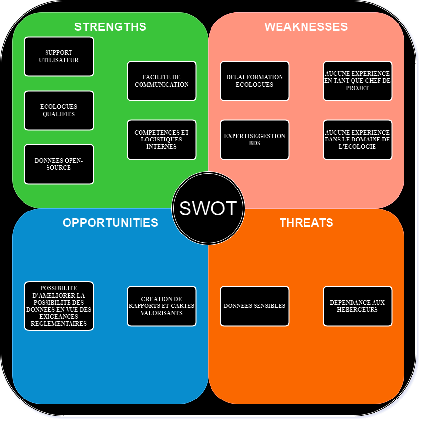

### [📝 [PDF] Support de Cours](A1N1_Ingenierie-et-Jalons.pdf)

### [📝 [PDF] Trame Charte Projet](trame_charte_projet.pdf)

### [🧪 [Markdown] Exercice QQQOPCC](EXO.MD)

### [🧪 [PDF] TP Charte Projet]()
---
### [↺ Retour](../README.MD)
---
### [↺ Racine](../../../README.MD)
---
# Formation "Ingénierie de Projet et ses Jalons Clés"

*11 décembre 2024* 

---
#### [➤&nbsp;A. Définition d'un Projet](README.MD#a-definition-dun-projet)
#### [➤&nbsp;B. Les Etapes d'un Projet](README.MD#b-les-etapes-dun-projet-1)
#### [➤&nbsp;C. ](README.MD#c-)
#### [➤&nbsp;D. ](README.MD#d-)
#### [➤&nbsp;E. ](README.MD#e-)
---

# A. DEFINITION D'UN PROJET

# B. LES ETAPES D'UN PROJET
## Timeline du projet
> Avant-Projet | Cadrage | Planification | Exécution et Surveillance | Clotûre
> ---|---|---|---|---
> Décision de faisabilité | <li>Définition du projet</li><li>Définition des objectifs/besoins</li><li>Signature du contrat</li> | Organisation détaillée:<li>Temps</li><li>Coûts</li><li>Risques</li><li>Découpage des tâches</li> | Exécution<li>Coordination des ressources</li><li>Réalisation du périmètre</li> Surveillance<li>*Surveillance*</li> | *Clotûre*

## Avant-Projet
> L'objectif de cette phase est de disposer d'informations pertinentes pour éclairer la décision de démarrer ou non le projet.
>> Il peut-être judicieux de réaliser différentes analyses comme:
>>> - Etude de marché
>>> - 

## Cadrage
> ### **QQQOPCC**:
>*Quand ? Qui ? Quoi ? Où ?  Pourquoi ? Comment ? Combien ?*

> ### **Gemba Walk**:
> *'Gemba' du japonais signifie 'le véritable endroit', 'là où se trouve la réalité'. D'où le concept qui consiste à observer et se rapprocher de la situation de terrain pour mieux en comprendre les besoins ou pistes d'améliorations.*
---
> ### La Charte du Projet
>> - #### <mark>Définition des objectifs</mark>
>> Défini les objectifs du projet et les critères de mesure de succès.
> ---
>> - #### <mark>Périmètre du projet</mark>
>> Description générale des inclusions et exclusions du projet.
>>
>> Détaille également les caractéristiques du produit, service ou résultat à atteindre. 
> ---
>> - #### <mark>Jalons</mark>
>> Décrit les phases et étapes du projet ainsi que les points de vérification ou approbation.
>>
>> Indique également les contraintes en termes de délais à prendre en compte.
> ---
>> - #### <mark>Livrables</mark>
>> Définit les principaux produits, services ou résultats qui doivent être fourni dans le cadre du projet.
>>> *Ne pas oublier les livrables internes requis au management du projet.*
>>
>> Précise également les critères d'évaluation de la réussite et de la qualité des livrables.
> ---
>> - #### <mark>Budget et sources de financement</mark>
>> Présentation du budget global approuvé pour le projet ainsi qu'une estimation des coûts en différentes ressources *(humaines, matérielles et financières).*
>>> *Indiquer les différentes sources de financement pour supporter le projet.*
> ---
>> - #### <mark>Risques</mark>
>> Présentation initiale des risques, notemment stratégiques.
>>> Evaluer l'impact et la probabilité de chaque risque identifié.
>>
>> Détérminer la stratégie à adopter pour maîtriser chacun des risques, ainsi que la personne ou équipe en charge le cas échéant. 
>>
>> Les différents traitements possibles:
>>> - Eliminer le risque.
>>> - Atténuer le risque.
>>> - Transférer le risque.
>>> - Accepter le risque.
>>
>> Le **SWOT**: *Strengths, Weaknesses, Opportunities and Threats*
>>> Interne ou Externe, le SWOT ***ne peut pas*** être communiqué à tous les acteurs. 

> 
 
>   
<em>SPOILER</em>

>
>   
>
> 

> ---
>> - #### <mark></mark>
>> 
---
> #### La charte de projet est aussi le ***document de référence*** pour:
> - Valider les enjeux et opportunités du projet
> - 
> - 

## Planification
>
## Exécution
>
## Surveillance
>
## Clôture
>

# C. 

# D.

# E.
