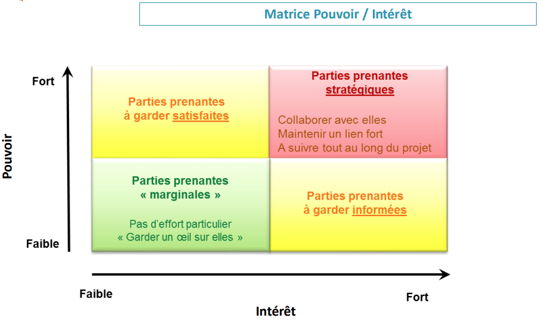
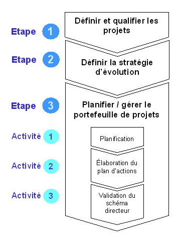
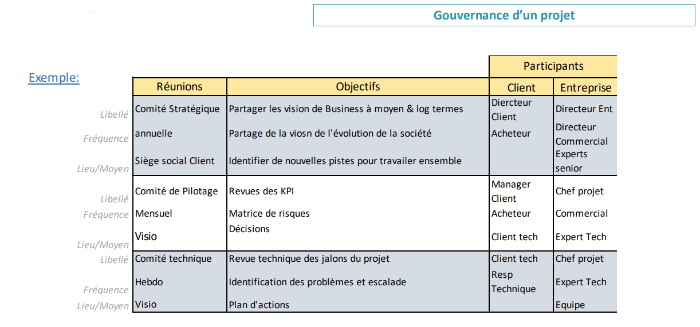
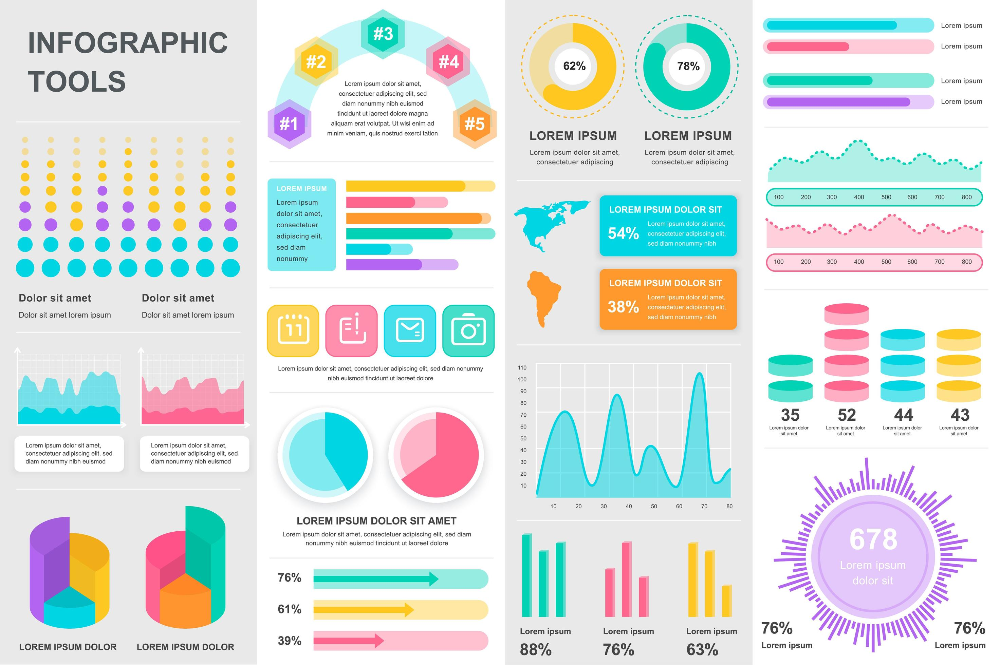

### [↳ Support PDF]()
---
### [↺ Retour](../README.MD)
---
### [↺ Racine](../../../README.MD)
---
# Formation "Enjeux et Stratégies du Projet"

*10/11 décembre 2024* 

---
#### [➤&nbsp;A. Organisation des Entreprises](README.MD#a-organisation-des-entreprises)
#### [➤&nbsp;B. Pourquoi un Projet ?](README.MD#b-pourquoi-un-projet)
#### [➤&nbsp;C. La Gouvernance](README.MD#c-la-gouvernance-1)
#### [➤&nbsp;D. Pilotage du projet](README.MD#d-pilotage-du-projet-1)
#### [➤&nbsp;E. SMQ](README.MD#e-smq-1)
#### [➤&nbsp;D. SMQ](README.MD#D-a-retenir)
---

# A. ORGANISATION DES ENTREPRISES
## DEFINITION
>><dl>
>>  <dt>Entreprise:</dt>
>>  <dd>Unité économique, juridiquement autonome dont la fonction principale est de produire des biens ou des services pour un marché.</dd>
>></dl>
>
> ---
>
>><dl>
>>  <dt>Entreprise Privée:</dt>
>>  <dd>Produit ou vend des biens ou des services avec pour finalité de réaliser des bénéfices tout en cherchant à assurer sa pérennité, prône la compétitivité et très attachée à sa réputation.</dd>
>></dl>
>
> ---
>
>><dl>
>>  <dt>Entreprise Public:</dt>
>>  <dd>Assure la création de services qui assurent le bien-être de tous les individus d'une société. Contrairement aux sociétés privées, la finalité principale des entreprises publiques n'est pas la réalisation d'un profit, mais le fait d'assurer un service public.</dd>
>></dl>

---

## ORGANIGRAMMES
>
> 
 
>   
<em>SPOILER</em>

>
>   
>
>   
>
>   
> 

---

# B. POURQUOI UN PROJET
> ## DEFINITION D'UN PROJET SI
> Un système d’information dans une entreprise comporte différents aspects:
>> - Fonctionnel
>> - Technique
>
> ---
>
> Les SI sont gérés et programmés par différents acteurs à différents niveaux:
>> - Infrastructure
>> - Logicielle
>> - Sécurité
>> - Maintenance

---

## POURQUOI UN PROJET SI
>
> - Organisationnelle:
>> Accompagner un changement ayant un impact:
>>> *Organisationnel*
>>>
>>> *Humain*
>>>
>
> ---
>
> - Technique:
>>
>> Harmoniser des processus /des organisations (entreprises publiques, croissance externe…)
>
> ---
>
> - Industrielle:
>> Innover, apporter une solution nouvelle sur le marché
>>
>> Améliorer la production ou toute étape de conception d’un produit (PLM, supply chain (optimisation des stocks…)
>
> ---
>
> - Humaine:
>> Favoriser la collaboration et le partage de connaissances
>>
>> Améliorer des conditions de travail (éviter des taches trop admin pour concentrer les personnes sur des taches à plus forte valeur ajoutée)
>
> ---
>
> - Economique:
>> Optimiser/Gagner en performance
>>
>> Faire du gain/ croissance

---

## ENJEUX ET OBJECTIFS
>
> ### ENJEUX
>> <mark>Economique:</mark>
>>> L’Investissement engendré par le projet doit apporter des résultats financiers:
>>>> Augmentation de Chiffre d’Affaires (CA) – gain financier
>>>>
>>>> Réduction de coût de réalisation d’une ou de plusieurs taches – économie conséquente
>>
>> ---
>>
>> <mark>Humain:</mark>
>>>Le projet peut influer sur l’organisation de l’entreprise et donc toucher l’humain:
>>>>
>>>> Bouleversement dans l’organisation
>>>>
>>>> Optimisation des ressources nécessaires à la réalisation d’une tâche (pluridisciplinarité, tache à forte valeur ajoutée
>>>>
>>>>Faciliter les traitements entre différents services ou organisations
>>
>> ---
>>
>> <mark>Technique:</mark>
>>> Le projet va permettre d’améliorer son positionnement sur un marché ou en interne:
>>>> Compétitivité : réussir à réaliser mieux, dans un meilleur délai à un meilleur prix
>>>>
>>>> Innovation : proposer une nouvelle façon de travailler
>>>>
>>>> Performance: améliorer sa productivité et son efficacité

---

## PARTIES PRENANTES
> ### DEFINITION
>><dl>
>>  <dt>Partie prenante:</dt>
>>  <dd>Une personne (ou organisation) impliquée dans le projet, ou qui peut être impactée par celui-ci.</dd>
>> <dd><em>Elle peut exercer une influence sur le projet.</em></dd>
>></dl>
>
> ---
>
> ### LES DIFFERENTS PARTIES
>> 1. Clients internes
>>
>> 1. Clients externes
>> 
>> 1. Commanditaires
>> 
>> 1. Futurs utilisateurs
>> 
>> 1. Décideurs de l’entreprise
>>
>> 1. DSI
>> 
>> 1. Fournisseurs
>> 
>> 1. Prestataires
>> 
>> 1. Partenaires
>>
>> 1. Equipe projet
>>
>> 1. Financier
>
> ---
>
>><dl>
>>  <dt>MOA:</dt>
>>  <dd>Maîtrise d'ouvrage.</dd>
>>  <dd><em>Entité représentant le besoin client.</em></dd>
>></dl>
>
> ---
>
>><dl>
>>  <dt>AMOA:</dt>
>>  <dd>Assistant à maîtrise d'ouvrage.</dd>
>>  <dd><em>Entité éventuellement mandaté par le client pour superviser la réalisation technique.</em></dd>
>></dl>
>
> ---
>
>><dl>
>>  <dt>MOE:</dt>
>>  <dd>Maîtrise d'œuvre.</dd>
>>  <dd><em>Entité en charge de la partie technique.</em></dd>
>></dl>
>
> ---
>
> ### MATRICE POUVOIR/INTERETS
>> 
 
>>   
<em>SPOILER</em>

>>
>>   
>
> ---
>
> ### A RETENIR
>> La gestion des parties prenantes permet de : 
>>> - Les identifier
>>> - Gérer leurs attentes et leur implication dans le projet
>>> - Créer une zone de confiance 
>>> - Anticiper des blocages potentiels
>>
>> ***La satisfaction des parties prenantes doit être gérée comme l’un des principaux objectifs du projet.***

---

## SCHÉMA DIRECTEUR
> ### INTERETS DU SCHEMA DIRECTEUR
>> **Pour la Direction Générale:**
>>> Moyen de consigner les choix stratégiques. C’est le moment idéal pour mener, au niveau de la direction, une réflexion approfondie sur l’informatique au sein de l’entreprise:
>>>> - Quelles sont les directions à donner ?
>>>>
>>>> - Quels sont les résultats à attendre ?
>>>>
>>>> - Quels sont les moyens à investir ?
>>
>> ---
>>
>> **Pour la DSI:**
>>> Permet de spécifier les missions et moyens à déployer et d’effectuer, en fonction de cela, une planification globale des projets et des investissements.
>>>
>>> Garantir une cohérence des outils informatiques au sein de l’entreprise.
>>
>> ---
>>
>> **Pour les utilisateurs:**
>>> Permet d’exprimer leurs attentes, de constater qu’elles sont prises en compte et traitées selon un processus harmonisé et équitable.
>
> ---
> ### DEFINITION, OBJECTIFS ET ETAPES
> #### DEFINITION
>><dl>
>>  <dt>Schéma Directeur:</dt>
>>  <dd>Outil de pilotage et d’ajustement permanent des évolutions du système d’information.</dd>
>></dl>
>
> ---
>
> #### OBJECTIFS
>>Fixer les règles de qualification des projets (niveau de priorité).
>>
>>Formaliser (systématiser) l’évaluation des nouveaux projets (critères, instances, arbitrage…).
>>
>>Revoir à fréquence régulière (trimestrielle) le portefeuille des projets et leur planification.
>
> #### ETAPES
>> 
 
>>   
<em>SPOILER</em>

>>
>>   

---

## DIMENSION / COMPLEXITÉ
> ### CONTEXTE
> Un projet informatique peut avoir des critères qui dimensionnent sa complexité:
>> - Nombre d’utilisateurs, nombre de pays
>> - Type d’utilisateurs : internes / externes
>> - Nombre d’outils existant sur le périmètre du projet
>> - Volume et nature des documents/données à traiter (contrats, normes Reach,…)
>> - Le nombre de processus de l’entreprise impacté (administratif ou production…)
>> - État de l’infrastructure informatique déjà existante
>> - Sécurité informatique
>> - Contraintes temporelles
>> - …
>
> ---
>
> ### A RETENIR
>> Ne pas négliger la dimension d’un projet et ses impacts humains, techniques et économiques. Il ne suffit pas de développer un nouvel outil pour qu’il soit utilisé.
>>
>> Cette démarche doit être surveillée (pilotage) et accompagnée (conduite du changement) à chaque étape du projet afin de s’assurer l’adhésion du plus grand nombre des futurs utilisateurs.

---

# C. LA GOUVERNANCE
## CONTEXTE
> ### DEFINITION:
>> La gouvernance de projet définit un mode de management et d’organisation. Elle permet d’identifier les rôles et les responsabilités de chaque partie prenante.
>
> ---
>
> ### OBJECTIFS:
>> - assurer le bon déroulement des activités, leur suivi
>> - faciliter la communication et la prise de décisions,
>> - organiser la séquence des réunions nécessaires au suivi du projet (création et suivi des réunions, communication entre les instances, identification des participants)
>> - Identifier rapidement les risques du projet et ajuster le planning
>
> ---
>
> ### CONSEILS
>> Définir la gouvernance le plus en amont possible dans le projet est l’une des clés de la réussite. Cela permet de structurer et de définir une organisation claire.

---

## RÔLES
> ### La Maitrîse d'Ouvrage (MOA):
>> C’est le sponsor, voire le propriétaire du projet. Dans une relation client-fournisseur, le MOA est le client.
>>> - Donne les objectifs du futur système, le budget et intervient au niveau du pilotage et de la vue fonctionnelle.
>>> - Nomme un assistant maître d'ouvrage (AMOA)
>>
>> La MOA assure les missions :
>>> - D'expression de besoins
>>> - De conduite du changement
>>
>> La MOA intervient à un niveau fonctionnel pour:
>>> - Vérifier la conformité des solutions avec les exigences, adapter l'organisation, définir les nouvelles procédures
>>> - Préparer et piloter la conduite du changement (sensibiliser les personnes, formation)
>>> - Assurer la communication vers les utilisateurs
>
> ---
> 
> ### L'assistance à Maitrîse d'Ouvrage (AMOA):
>> Nommé par la MOA pour agir par délégation afin de mener à bien le projet. Il est l’œil du MOA dans l’exécution du projet
>> 
>>> Il a une meilleure connaissance technique que la MOA pour échanger avec la MOE
>>>
>>> Formalise les objectifs en exigences
>>> 
>>> Prépare les validations des solutions qui seront pilotées par la MOA
>>> 
>>> Supervise le planning de la MOE (maîtrise d’œuvre)
>>
>> L'AMOA (entité appartenant à la même entreprise ou à des sociétés externes spécialisées dans les domaines requis) est constituée de spécialistes pour :
>>> Formaliser le besoin des utilisateurs sous forme de cahier des charges fonctionnel
>>>
>>>Définir les exigences de management de projet et d'assurance qualité
>>>
>>>Préparer et conduire les appels d'offres et aider au dépouillement des offres
>>>
>>>Définir et conduire les opérations de validation vis-à-vis de la MOE
>
> ---
>
> ### Maitrîse d'Œuvre (MOE)
>> Entité qui est chargée de l’exécution du projet. En d’autres termes, il réalise le projet selon les besoins exprimés par le MOA. Dans une relation client-fournisseur, la MOE est le fournisseur.
>>> Elle met en œuvre:
>>>> - Le planning
>>>>- Les moyens humains et logistiques (prestataires, ...)
>>>
>>> Pour réaliser les livrables définis du projet.
>>
>>> Ces livrables (documents ou produits) sont définis dans un contrat mentionnant les dates et jalons de livraison et les détails de calcul des pénalités éventuelles en cas de retard ou de non conformité.
>>
>>> La relation MOA - MOE permet de:
>>>> - Formaliser les besoins de la MOE pour réaliser le système
>>>> - Vérifier par la MOA que les réalisations sont conformes aux attentes

---

## RÉUNIONS
> ### EXEMPLE
> 
 
>   
<em>SPOILER</em>

>
>   

---

# D. PILOTAGE DU PROJET
> ## KPI
> Un tableau de bord est un outil d’aide à la décision qui permet grâce à la mise en place d’indicateurs clés (KPI) de piloter efficacement un projet.
> 
> KPI signifie Key Performance Indicator en anglais.
>> Aussi appelés indicateurs clés de performance (ICP), ils sont très utilisés dans le suivi de projet et permettent de mesurer les performances de vos projets.
>
>> Les KPI doivent être définis conjointement par le chef de projet et son équipe avant de démarrer le projet.
>
>> Pour bien définir des KPI:
>>> - Il est associé à un objectif précis
>>> - Il implique forcément une décision
>>> - Il n’est jamais muet
>>> - Pour être pertinent, il doit être simple
>
> ---
>
> ## INDICATEURS
> Il s’agit d’une information (issue d’une mesure) qui aide à évaluer une situation et à prendre une décision adaptée. Un indicateur doit être réaliste, mesurable et défini dans le temps.
> 
> La valeur d’un indicateur est très souvent représentée par un graphique afin de voir son évolution dans le temps.
>
> La représentation de tous les indicateurs choisis se fait de façon synthétique dans un tableau de bord où l’on retrouve :
>> - Le nom de chaque indicateur
>> - Sa règle de calcul, son unité de mesure, 
>> - Ses dates de début et de fin
>> - Le seuil ou la performance attendue
>> - La valeur réelle de l’indicateur
>>
>>> Si l’indicateur est au vert, tout va bien, il vous faudra donc poursuivre les actions en cours afin de maintenir ce bon résultat.
>>>
>>> Si l’indicateur est au rouge, vous devez alors prendre les mesures correctives nécessaires.
>>>
>>> Si l’indicateur est au orange, il faut le surveiller.
>
> Il est important de bien choisir ses KPI afin d’être capable d’identifier rapidement les écarts et les risques d’écarts par rapport à l’objectif, ainsi que l’efficacité des mesures d’améliorations lancées. 
>
> Cela permet également de communiquer efficacement avec les différents acteurs du projet.
---

## TABLEAU DE BORD
> ### DEFINITION
><dl>
>  <dt>Tableau de bord:</dt>
>  <dd>Permet de suivre l'état de santé d'un projet grâce à des indicateurs claires et précis sur les différents critères principaux..</dd>
></dl>
>
> ---
> ### EXEMPLE
> 
 
>   
<em>SPOILER</em>

>
>   
---

# E. SMQ
><dl>
>  <dt>SMQ:</dt>
>  <dd>Système de Management de Qualité.</dd>
>  <dd><em>Organisation mise en place par une entreprise pour atteindre sa politique et ses objectifs qualité.</em></dd>
></dl>
>
>> On parle de système, car le SMQ (Système de Management de la Qualité) englobe des
acteurs, des activités et matériels divers dans l’entreprise de manière simultanée et interdépendantes pour atteindre l’objectif visé en lien avec la satisfaction du client final.
>>
>> Ce système est coordonné et piloté par la ligne managériale de l’entreprise, qui se donne
ainsi les moyens d’atteindre les priorités qu’elle a elle-même définies.
>>
>> Le SMQ doit correspondre à la réalité de l’organisation de l’entreprise et non constituer
un système factice, établi en théorie, dans le seul souci de répondre à l’exigence externe
du client.
>>
>> ---
>>
>> Il se décine en **sept grands principes**:
>>> #### 1. Orientation client
>>>> L’objectif de n’importe quelle entreprise, quel que soit son domaine d’activité, est de satisfaire les attentes de sa clientèle en lui fournissant des produits et services adaptés à ses exigences.
>>>>> Il s’agit donc d’identifier ses attentes, voire de les anticiper, pour augmenter sa satisfaction et parvenir à terme à le fidéliser
>>> ---
>>> #### 2. Résponsabilité de direction
>>>> Au sein du système complexe que représente une organisation, c’est la direction qui est chargée de définir la stratégie à suivre, les objectifs à atteindre et les moyens pour y parvenir.
>>>> 
>>>> C’est aussi à elle qu’incombe la lourde tâche de créer les conditions favorisant l’amélioration.
>>>>> Pour ce faire, le leader doit faire en sorte de communiquer les objectifs de la manière la plus claire possible et de partager les valeurs de l’entreprise avec ses collaborateurs, en montrant l’exemple.
>>>>
>>>> Il doit par ailleurs générer un climat de confiance, basé sur l’encouragement et la reconnaissance.
>>>>> Des pilotes de processus sont nommés et c’est eux qui dynamiseront la démarche.
>>> ---
>>> #### 3. Implication du personnel
>>>>Afin de s’assurer que le personnel est pleinement impliqué dans le projet, il est impératif de trouver des moyens de favoriser et valoriser son engagement.
>>>>> En d’autres termes, le salarié doit être conscient de la valeur ajoutée que représente sa contribution personnelle, quelle que soit la place qu’il occupe au sein de l’entreprise, indépendamment de son ancienneté ou de son niveau hiérarchique.
>>>>
>>>> Il est également nécessaire de vérifier que chacun dispose des habilitations et des compétences requises pour réaliser les tâches qui lui sont confiées, au risque de compromettre le but recherché.
>>
>>> #### 4. Approche processus
>>>> Ce principe insiste sur le fait que les activités de l’entreprise doivent être envisagées comme autant de processus corrélés entre eux.
>>>>
>>>> L’objectif est ici de mettre en exergue le cheminement menant à un résultat observé, afin de le comprendre et d’en dégager plus facilement des axes d’amélioration.
>>>>
>>>> En agissant de cette manière, l’organisation renforce la cohérence et l’efficacité de son système, sa capacité à gérer les risques, et par la même, la confiance que sa clientèle porte en elle.
>>
>>> #### 5. Amélioration
>>>> Pour rester compétitive et performante dans un contexte économique en constante évolution, une
organisation doit elle-même évoluer.
>>>>
>>>> C’est le fameux principe d’amélioration continue, qui va de pair avec la notion de qualité et trouve par exemple son application dans le cycle PDCA ou roue de Deming.
>>>>
>>>> Pour entrer en résonance avec ce 5e principe, l’entreprise doit rechercher les opportunités d’améliorations partout où elles se trouvent, qu’elles soient appliquées par rupture ou de manière progressive, et inscrire l’effort d’innovation dans la culture de l’entreprise afin d’impliquer les collaborateurs, à tous les étages de la hiérarchie.
>>
>>> #### 6. Prise de décision fondée sur des preuves
>>>>Face au degré d’incertitude parfois élevé que peut impliquer la prise de décision, l’organisation doit se tourner vers des sources de données et preuves fiables, par le biais des indicateurs clés de performances par exemple, pour pouvoir poser des actions en toute connaissance de cause.
>>>>
>>>> De plus, ces différents éléments doivent être analysés de manière objective afin d’éviter les mauvaises interprétations qui pourraient conduire à un choix malencontreux.
>>
>>> #### 7. Management des relations avec les parties intéressées
>>>> Les « parties intéressées » correspondent aux divers acteurs avec lesquels l’entreprise est amenée à collaborer au quotidien, notamment ses fournisseurs, prestataires et autres partenaires commerciaux.
>>>>> Concrètement, si elle veut améliorer ses performances, les conserver dans le temps et répondre aux attentes de ses clients, elle doit soigner ces relations professionnelles en partageant par exemple les informations utiles de manière adéquate ou mettre en place des stratégies d’amélioration de façon conjointe.
>>
> Un bon SMQ **doit**:
>>> Etre adapté précisément à la culture de l’entreprise, à son
contexte, ses services, ses managers, ses produits… 
>> 
>>Il se montre alors performant.
>>
>> En suivant consciencieusement les fondamentaux du management de la qualité, l’entreprise ou
l’organisation est en mesure d’accroître sa rentabilité, sa stabilité financière et assurer sa création de valeur.
>
> ---
>
>><dl>
>>  <dt>PAQ:</dt>
>>  <dd>Plan d'Assurance Qualité.</dd>
>>  <dd><em>Standards de qualité mis en place au niveau du projet.</em></dd>
>></dl>

---

# D. A RETENIR
> Un projet SI:
>> - Répond à un besoin économique, humain ou industriel de l’entreprise
>> - S’intègre dans une stratégie SI à travers un schéma directeur
>> - Implique un ensemble de parties prenantes
>> - Est piloté / financé par la MOA, assistée ou non d’une AMOA
>> - Est réalisé par la MOE
>> - Est piloté grâce à la gouvernance et la mise en place d’indicateurs
>> - Répond à des exigences qualité de l’entreprise adaptées dans un PAQ
