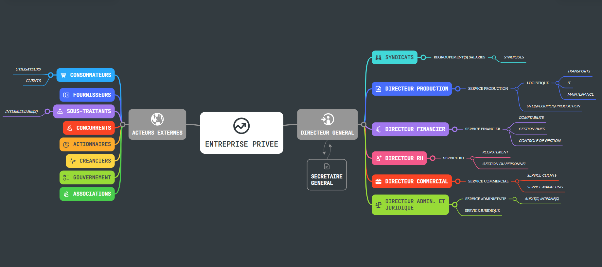
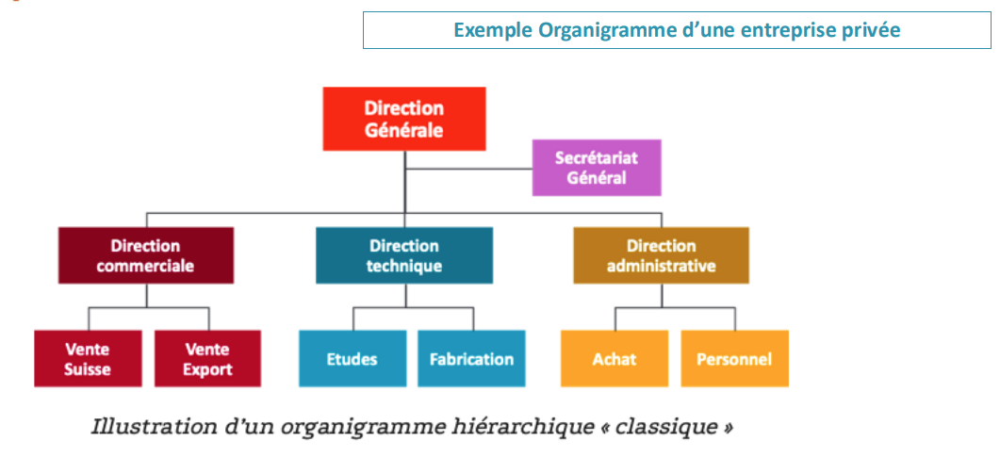
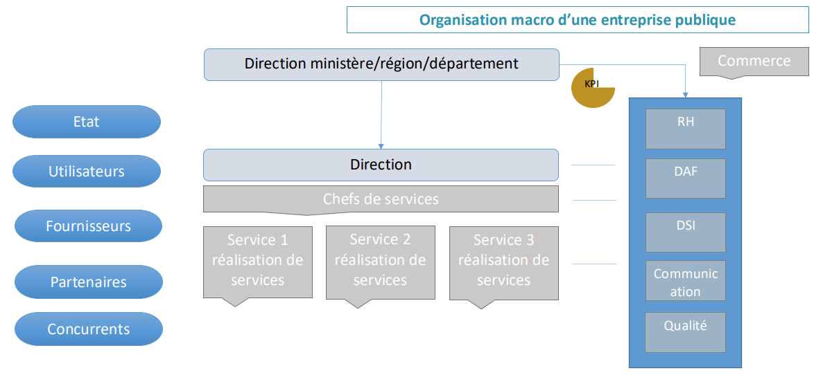

### [↳ Support PDF]()
---
### [↺ Retour](../README.MD)
---
### [↺ Racine](../../../README.MD)
---
# Formation "Enjeux et Stratégies du Projet"

*10/11 décembre 2024* 

---
#### [➤&nbsp;A. Organisation des Entreprises](README.MD#a-organisation-des-entreprises)
#### [➤&nbsp;B. Pourquoi un Projet ?](README.MD#b-pourquoi-un-projet)
#### [➤&nbsp;C. La Gouvernance](README.MD#c-la-gouvernance-1)
#### [➤&nbsp;D. Pilotage du projet](README.MD#d-pilotage-du-projet-1)
#### [➤&nbsp;E. SMQ](README.MD#e-smq-1)
---

## A. ORGANISATION DES ENTREPRISES
### DEFINITION
><dl>
>  <dt>Entreprise:</dt>
>  <dd>Unité économique, juridiquement autonome dont la fonction principale est de produire des biens ou des services pour un marché.</dd>
></dl>
>
><dl>
>  <dt>Entreprise Privée:</dt>
>  <dd>Produit ou vend des biens ou des services avec pour finalité de réaliser des bénéfices tout en cherchant à assurer sa pérennité, prône la compétitivité et très attachée à sa réputation.</dd>
></dl>
>
><dl>
>  <dt>Entreprise Public:</dt>
>  <dd>Assure la création de services qui assurent le bien-être de tous les individus d'une société. Contrairement aux sociétés privées, la finalité principale des entreprises publiques n'est pas la réalisation d'un profit, mais le fait d'assurer un service public.</dd>
></dl>

### ORGANIGRAMMES

> 
 
>   
<em>SPOILER</em>

>
>   
>
>   
>
>   
> 

## B. POURQUOI UN PROJET
### DEFINITION D'UN PROJET SI
> Un système d’information dans une entreprise comporte différents aspects:
>> - Fonctionnel
>> - Technique
>
> ---
>
> Les SI sont gérés et programmés par différents acteurs à différents niveaux:
>> - Infrastructure
>> - Logicielle
>> - Sécurité
>> - Maintenance

### POURQUOI UN PROJET SI
> - Organisationnelle:
>> Accompagner un changement ayant un impact:
>>> *Organisationnel*
>>>
>>> *Humain*
>>>
>
> ---
>
> - Technique:
>>
>> Harmoniser des processus /des organisations (entreprises publiques, croissance externe…)
>
> ---
>
> - Industrielle:
>> Innover, apporter une solution nouvelle sur le marché
>>
>> Améliorer la production ou toute étape de conception d’un produit (PLM, supply chain (optimisation des stocks…)
>
> ---
>
> - Humaine:
>> Favoriser la collaboration et le partage de connaissances
>>
>> Améliorer des conditions de travail (éviter des taches trop admin pour concentrer les personnes sur des taches à plus forte valeur ajoutée)
>
> ---
>
> - Economique:
>> Optimiser/Gagner en performance
>>
>> Faire du gain/ croissance

### ENJEUX ET OBJECTIFS
> #### ENJEUX
>> <mark>Economique:</mark>
>>> L’Investissement engendré par le projet doit apporter des résultats financiers:
>>>> Augmentation de Chiffre d’Affaires (CA) – gain financier
>>>>
>>>> Réduction de coût de réalisation d’une ou de plusieurs taches – économie conséquente
>>
>> ---
>>
>> <mark>Humain:</mark>
>>>Le projet peut influer sur l’organisation de l’entreprise et donc toucher l’humain:
>>>>
>>>> Bouleversement dans l’organisation
>>>>
>>>> Optimisation des ressources nécessaires à la réalisation d’une tâche (pluridisciplinarité, tache à forte valeur ajoutée
>>>>
>>>>Faciliter les traitements entre différents services ou organisations
>>
>> ---
>>
>> <mark>Technique:</mark>
>>> Le projet va permettre d’améliorer son positionnement sur un marché ou en interne:
>>>> Compétitivité : réussir à réaliser mieux, dans un meilleur délai à un meilleur prix
>>>>
>>>> Innovation : proposer une nouvelle façon de travailler
>>>>
>>>> Performance: améliorer sa productivité et son efficacité

### PARTIES PRENANTES
> #### DEFINITION
>><dl>
>>  <dt>Partie prenante:</dt>
>>  <dd>Une personne (ou organisation) impliquée dans le projet, ou qui peut être impactée par celui-ci.</dd>
>> <dd><em>Elle peut exercer une influence sur le projet.</em></dd>
>></dl>
>
> ---
>
> #### LES DIFFERENTS PARTIES
>> 1. Clients internes
>>
>> 1. Clients externes
>> 
>> 1. Commanditaires
>> 
>> 1. Futurs utilisateurs
>> 
>> 1. Décideurs de l’entreprise
>>
>> 1. DSI
>> 
>> 1. Fournisseurs
>> 
>> 1. Prestataires
>> 
>> 1. Partenaires
>>
>> 1. Equipe projet
>>
>> 1. Financier
>
> ---
>
><dl>
>>  <dt>MOA:</dt>
>>  <dd>Maîtrise d'ouvrage.</dd>
>>  <dd><em>Entité représentant le besoin client.</em></dd>
>
></dl>
>
> ---
>
><dl>
>>  <dt>AMOA:</dt>
>>  <dd>Assistant à maîtrise d'ouvrage.</dd>
>>  <dd><em>Entité éventuellement mandaté par le client pour superviser la réalisation technique.</em></dd>
>
></dl>
>
> ---
>
><dl>
>>  <dt>MOE:</dt>
>>  <dd>Maîtrise d'œuvre.</dd>
>>  <dd><em>Entité en charge de la partie technique.</em></dd>
>
></dl>

### SCHÉMA DIRECTEUR

### DIMENSION / COMPLEXITÉ

## C. LA GOUVERNANCE

### RÔLES

### RÉUNIONS

## D. PILOTAGE DU PROJET

### KPI

### TABLEAU DE BORD
> **Le tableau de bord permet de suivre l'état de santé d'un projet grâce à des indicateurs claires et précis sur les différents critères principaux.**

## E. SMQ
><dl>
>>  <dt>SMQ:</dt>
>>  <dd>Système de Management de Qualité.</dd>
>>
>>  <dd><em>Organisation mise en place par une entreprise pour atteindre sa politique et ses objectifs qualité.</em></dd>
>
></dl>
>
> ---
>
>> Il se décine en **sept grands principes**:
>>> 1. Orientation client
>>>
>>> 1. Résponsabilité de direction
>>>
>>> 1. Implication du personnel
>>>
>>> 1. Approche processus
>>>
>>> 1. Amélioration
>>>
>>> 1. Prise de décision fondée sur des preuves
>>>
>>> 1. Management des relations avec les parties intéressées
>>
>> Un bon SMQ doit:
>>> 
>
> ---
>
><dl>
>>  <dt>PAQ:</dt>
>>  <dd>Plan d'Assurance Qualité.</dd>
>>
>>  <dd><em>Standards de qualité mis en place au niveau du projet.</em></dd>
></dl>
